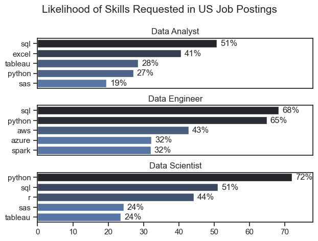
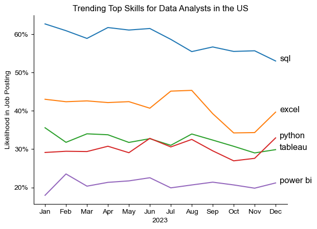
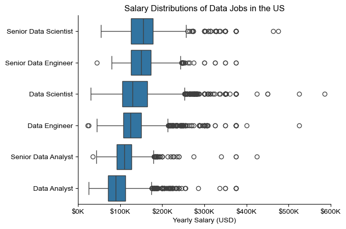
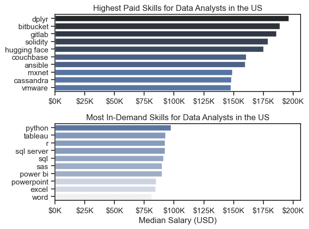
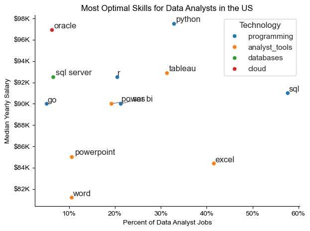

# Overview
The data analytics job market is highly competitive, making it important to understand which skills and roles offer the greatest career opportunities. This project uses Python to analyze a real-world dataset of data job postings in the United States, uncovering insights into salary trends, in-demand skills, and the qualifications employers seek for data-related roles.

The dataset used in this project was sourced from Luke Barousse's Python course, providing a solid foundation for exploring the data analytics job market. It contains detailed information on job titles, salaries, locations, and the skills required for various data-related roles. Using a series of Python scripts, I analyzed the dataset to answer key questions, including identifying the most in-demand skills, examining salary trends across data careers, and uncovering the relationship between skill demand and salary. The insights generated from this analysis offer valuable guidance for aspiring data professionals while demonstrating practical data analysis and visualization skills using Python.

# The Questions 
Below are the questions i want to answer in my project:

1. What are the top 3 most in demand skills for data roles?

2. How are in-demand skills trending for Data Anlysts?

3. How well do jobs and skills pay for Data Analyst?

4. What are the optimal skills for Data Analysts to learn?

# Tools I Used

For my deep dive into data analysts job market, i used the power of several tools:

* **Python**: The backbone of my analsis, allowing me to analyze the data and find critical insight. i also used the following python liberires:
    *  **Pandas Libary**: This was used to analyze the data.
    * **Matplotlib Libary**: I used this to visualize the data.
    * **Seaborn Libary**: Used it for more advance visuals.
* **Jupyter Notebook**: The tool i used to run my python script which easily let me include my notes and analysis
* **Visual Studios Code**: My go-to for excuting python scripts.
* **Git & GitHub**: Essential for sharing my code and analysis.

# The Analysis

## 1. What are the most demande skills for the Top Three most popular data roles?

To identify the most in-demand skills for the three most popular data roles, I first determined which job titles had the highest number of postings. I then analyzed those roles to find their top five most frequently requested skills. This query highlights the relationship between the most common data roles and the skills employers value most, helping job seekers understand which skills to prioritize based on their target career path.

View my notebook with detailed steps here:
[2_Skills_Count.ipynb](Project\2_Skills_Count.ipynb)

### Results

### Insights 

- SQL is the most essential skill, appearing among the top requested skills for all three roles and ranking first for both Data Analysts (51%) and Data Engineers (68%).
- Programming skills become more important in advanced data roles, with Python being the most requested skill for Data Scientists (72%) and nearly as important as SQL for Data Engineers (65%).
- Each role requires a unique skill set: Data Analysts emphasize Excel and Tableau for reporting, Data Engineers focus on cloud technologies like AWS and Azure, while Data Scientists rely on Python and R for statistical analysis and machine learning.

## 2. How are in-demand skills trending for data analysis?

### Results

*Bar graph vizualizing the trending top skills for data analyst in the us in 2026.*

### Insights:
Here are three concise insights from the chart:

* SQL remained the most in-demand skill throughout 2023, consistently leading all other skills despite experiencing a slight decline toward the end of the year.

* Excel demand fluctuated during the year, peaking around July and August before declining in the final months, indicating changing employer priorities.

* Python and Tableau maintained relatively stable demand, while Power BI remained the least requested skill, suggesting it is valuable but less frequently required than other core data analyst skills.

## 3 How well do jobs and skills pay for Dta Analysis?
### Results

*Box plot visualizing the salary distribution for the top 6 data job titles.*

### Insights 
* Senior-level positions command the highest salaries, with Senior Data Scientists and Senior Data Engineers showing the highest median salaries and upper salary ranges among all data roles.

* Data Scientist roles exhibit the widest salary variation, with salaries ranging from relatively moderate levels to exceptionally high outliers exceeding $500,000, indicating significant differences based on experience, industry, and company.

* Data Analysts earn the lowest salaries among the roles shown, but Senior Data Analysts can achieve compensation levels comparable to mid-level Data Engineers and Data Scientists, highlighting the value of experience and career progression.

## 3 How well do jobs and skills pay for Data
### Highest Paid & Most Demanded Skills for Data 

#### Visualize Data 

#### Insight
* The highest-paying skills are not necessarily the most in demand. Specialized skills such as Dplyr, Bitbucket, GitLab, and Solidity command the highest median salaries, even though they are less commonly requested in job postings.

* Python is the most valuable mainstream skill, ranking as the most in-demand skill while also offering one of the highest median salaries among the commonly requested skills, making it an excellent investment for aspiring data analysts.

* Core data analyst tools like SQL, Tableau, Excel, and Power BI remain highly sought after, demonstrating that employers continue to prioritize foundational technical skills, even if they do not always offer the highest salaries compared to niche technologies.

## 4. What is the most optimal skill to learn for Data Analysis?

#### Visualization

#### Insights
* Python offers the best balance of demand and salary, combining one of the highest median salaries (about $98K) with strong demand (around 31% of job postings), making it one of the most valuable skills for data analysts.

* SQL remains the most in-demand skill, appearing in nearly 60% of job postings, although its median salary is slightly lower than Python's, highlighting its importance as a foundational skill.

* Specialized skills such as Oracle and SQL Server command competitive salaries despite lower demand, while tools like Excel, Word, and PowerPoint are widely useful but generally offer lower salary potential, suggesting that learning programming and database technologies can lead to greater career opportunities.
`
# What I Learned
Throughout this project, I strengthened my understanding of Python for data analysis by working with real-world job market data. Using Python libraries such as Pandas and Matplotlib, I learned how to clean, analyze, and visualize data to uncover meaningful insights and support data-driven decision-making.

* **Data Cleaning and Preparation**: Learned how to handle missing values, remove duplicates, format data correctly, and prepare datasets for analysis using Pandas.

* **Data Analysis and Exploration**: Improved my ability to filter, group, aggregate, and analyze data to answer important questions about salaries, skills, and job demand.

* **Data Visualization**: Gained experience creating charts and graphs with Matplotlib to clearly communicate trends, comparisons, and insights from the analysis.

# Insights

This project provided several general insight =s into the data job market for analysts:
* SQL and Python are the most valuable skills for data professionals. SQL consistently ranks as the most in-demand skill across data roles, while Python offers an excellent combination of high demand and competitive salaries, making both essential skills for anyone pursuing a career in data analytics.
* Higher salaries are closely linked to specialized skills and experience. Senior-level positions, particularly in Data Science and Data Engineering, command the highest salaries. In addition, niche technologies such as Dplyr, GitLab, and Bitbucket offer premium salaries despite lower demand, showing that specialization can significantly increase earning potential.
* The skills required vary by role, but core analytical tools remain essential. Data Analysts rely heavily on SQL, Excel, Tableau, and Power BI, whereas Data Engineers and Data Scientists require stronger programming and cloud computing skills. Understanding the skill requirements for a target role helps professionals focus their learning on technologies that maximize both employability and salary growth.

# Challenges I Faced
* **Data Cleaning**: One of the biggest challenges was preparing the dataset for analysis by handling missing values, ensuring consistent data formats, and filtering out incomplete records to produce reliable results.
* **Selecting the Right Analysis Approach**: Identifying the most effective methods to answer each business question required careful use of data filtering, grouping, aggregation, and visualization techniques to extract meaningful insights.
* **Creating Clear Visualizations**: Presenting complex findings in a simple and understandable way was challenging. Choosing appropriate chart types and organizing the data effectively helped communicate trends in salaries, skill demand, and job roles more clearly.

# Conclusion 
This project demonstrates how Python can be used to transform raw job market data into meaningful insights. By analyzing salary trends, in-demand skills, and career opportunities within the data analytics field, I gained valuable experience in data cleaning, exploration, visualization, and analytical thinking. The findings highlight the importance of developing both foundational and specialized technical skills while showcasing how data-driven analysis can support informed career decisions and solve real-world business problems.